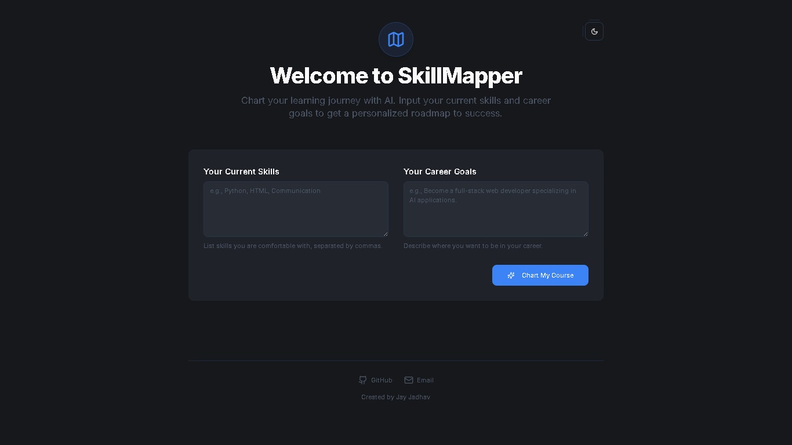
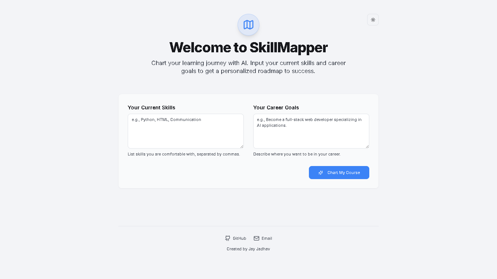
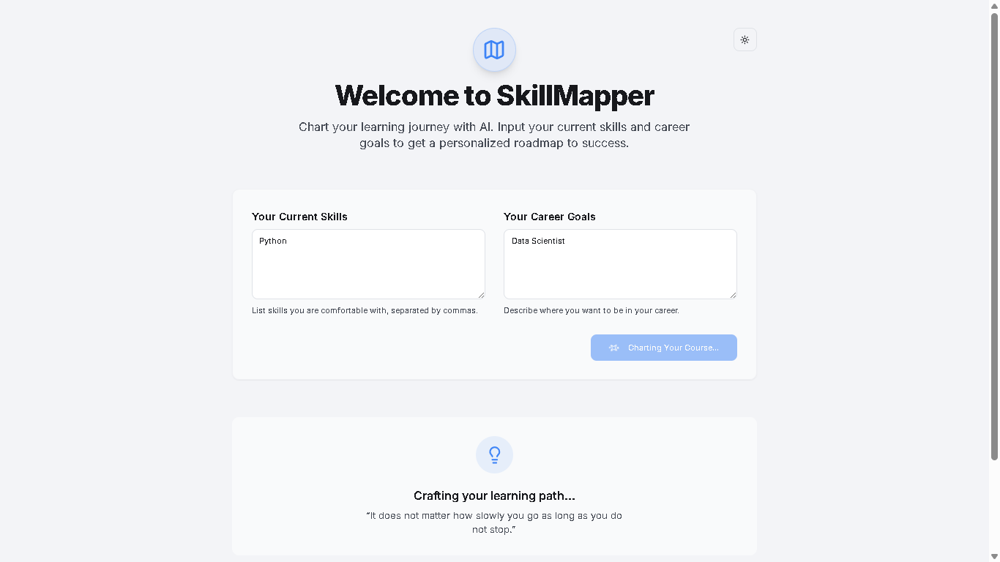
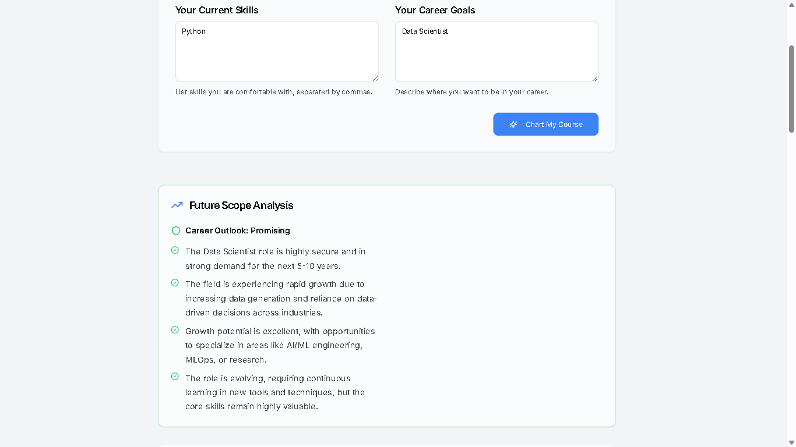
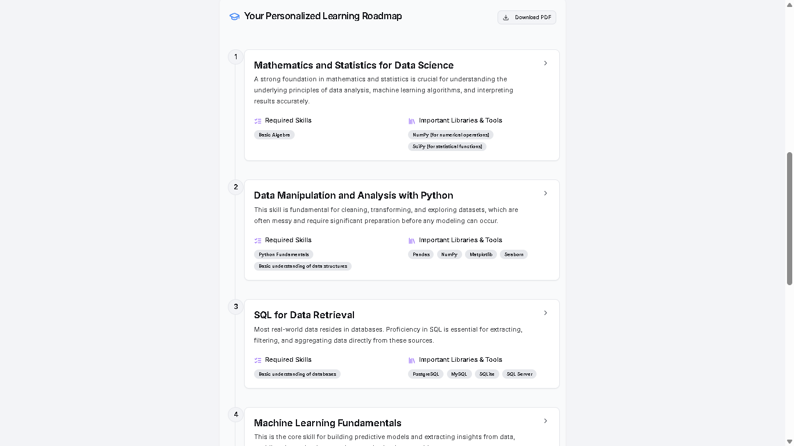
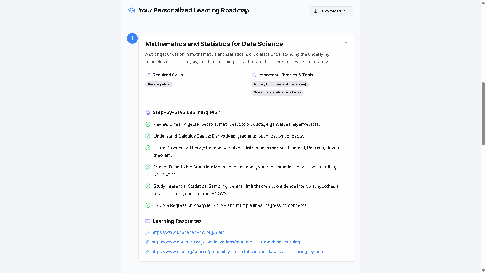

# SkillMapper 🚀

SkillMapper is an AI-powered career roadmap generator that creates personalized learning paths based on a user's current skills and career goals.

Built using modern web technologies and AI prompt engineering, the platform helps students and aspiring developers understand:
- What to learn
- In what order to learn
- Which tools and libraries are important
- Future career scope and industry demand

This project was developed using **Firebase Studio AI** with advanced **Prompt Engineering** techniques.

---

# 🌟 Features

✅ AI-generated personalized learning roadmaps  
✅ Career future scope analysis  
✅ Step-by-step learning guidance  
✅ Recommended tools & libraries  
✅ Learning resources suggestions  
✅ Download roadmap as PDF  
✅ Dark mode & Light mode support  
✅ Clean and responsive UI  
✅ Dynamic roadmap generation using AI prompts

---

# 🧠 AI & Prompt Engineering

This project heavily uses **Prompt Engineering** to generate structured and intelligent learning roadmaps.

The AI analyzes:
- User's current skills
- Career goals
- Required technologies
- Industry trends
- Skill dependencies

Then it creates:
- Ordered learning roadmap
- Required prerequisites
- Important tools/libraries
- Learning resources
- Career outlook analysis

---

# 🛠️ Tech Stack

- Next.js
- TypeScript
- Tailwind CSS
- Firebase Studio AI
- AI Prompt Engineering
- Vercel Deployment

---

# 📷 Project Screenshots

## 🔹 Home Page (Dark Mode)



---

## 🔹 Home Page (Light Mode)



---

## 🔹 AI Generating Learning Path



---

## 🔹 Future Scope Analysis



---

## 🔹 Step-by-Step Learning Sections



---

## 🔹 Detailed Learning Plan



---

# 📂 Project Structure

```bash
SkillMapper/
│
├── src/
├── docs/
├── .idx/
├── package.json
├── tsconfig.json
├── tailwind.config.ts
├── next.config.ts
├── README.md
│
└── Screenshot/
```

---

# ⚙️ Installation

## 1️⃣ Clone the Repository

```bash
git clone https://github.com/jayjadhav04/SkillMapper.git
```

---

## 2️⃣ Navigate to Project Directory

```bash
cd SkillMapper
```

---

## 3️⃣ Install Dependencies

```bash
npm install
```

---

# ▶️ Run the Project

```bash
npm run dev
```

---


---

# 📊 How It Works

1. User enters:
   - Current Skills
   - Career Goals

2. AI processes the input using Prompt Engineering.

3. The system generates:
   - Personalized roadmap
   - Learning sequence
   - Tools & libraries
   - Resources
   - Career future analysis

4. User can explore and download the roadmap as PDF.

---

# 🚀 Future Improvements

- Authentication system
- Save user roadmaps
- AI chat mentor
- Progress tracking dashboard
- Video/course recommendations
- Multi-language support
- Resume skill-gap analysis
- AI interview preparation module

---

# 🧩 Prompt Engineering Used

Examples of prompt engineering concepts used in this project:

- Structured AI prompting
- Context-based roadmap generation
- Skill dependency mapping
- Career progression analysis
- Dynamic AI response formatting
- Learning path optimization

---

# 🤝 Contributing

Contributions are welcome!

1. Fork the repository
2. Create a feature branch
3. Commit your changes
4. Push to your branch
5. Open a Pull Request

---

# 👨‍💻 Author

**Jay Dnyaneshwar Jadhav**

- GitHub: [jayjadhav04](https://github.com/jayjadhav04)
- LinkedIn: [jayjadhav04](https://www.linkedin.com/in/jayjadhav04)
---


